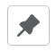

# Shopify Assistant

#### [What is it?](#what-is-it-anchor)
#### [How to use it?](#how-to-use-it-anchor)
#### [How to contribute?](#how-to-contribute-anchor)

---
### What is it? 
**Shopify Assistant** is a chrome extension that helps to manage multiple Shopify themes from various shops in one place. 

You may think of it as a catalog of all themes from all the shops you recently worked with. Each time you access an admin pannel of a shopify shop the extension loads themes available in the shop into the catalog. Once a theme is in the catalog you may have access to "preview" and "configure" links associated with this theme plus some additional options like **tags** and **QR codes**. 

The extension was created with one **idea** in mind - **make a daily work with multiple themes more effective and less tiresome**.  

**The target audience** is shopify owners and service personnel who create and maintain Shopify shops. If you don't have access to the shop's admin pannel this extention has no value for you.

The extention uses original Shopify UI library **Polaris** in order to make your work more intuitive and simple.   

### How to use it? 

1. Install **Shopify Assistant** from the [chrome web store](https://chrome.google.com/webstore/detail/shopify-assistant/dojndceiekjaaegeeaecemcgfaomcdjm).
2. Add extension's icon to the pannel next to the address bar in your browser.
3. Open shop's admin page. The extention will automatically load themes data into its local storage.
4. Click on the extention's icon to see the list of available themes. 

| Element | Description |
| :---:         |     :---      |
|    | A list of all themes  |
|    | A list of pinned themes  |
|    | A list of themes that no more exist in the shop  |
|    | Toggle button that adds a theme to the pinned list  |
|    | A goup of buttons (left to right): **View button** opens theme preview in a new tab, **Clipboard button** adds a preview url into a clipboard, **QR code button** shows a QR code with a preview url. |
|    | A goup of buttons (left to right): **Setup button** opens theme's configuration pannel in a new tab, **Clipboard button** adds a configuration pannel's url into a clipboard, **QR code button** shows a QR code with a configuration pannel's url. |
|    | Toggle button that shows a list of tags |

### How to contribute? 

You are more then welcome to contribute to this project. Any change request will be reviewed and included into the main code base if it adds value to the extension or it resolves an existing or potential probleme.

Before you start working on the project it's highly recommended to refresh your knowledge of:
- [React and React hooks](https://reactjs.org/docs/getting-started.html)
- [Shopify Polaris UI components](https://polaris.shopify.com/components/get-started)
- [Chrome extension docs](https://developer.chrome.com/docs/extensions/mv3/)
- [TypeScript](https://www.typescriptlang.org/docs/handbook/typescript-in-5-minutes.html)
- [How to contribute to open source projects on GitHub](https://github.com/firstcontributions/first-contributions)

Whatever you want to propose, it would be great if your modifications are inline with one of these improvement axes:
- Apply best practices (automation, ci/cd pipeline, tests, code style rules, etc.);
- Improve UI/UX;
- Integration with other Shopify and 3rd party services;
- Bug fixes. 

Before you come up with some idea for improvement, would you mind having a look at the following tasks from the mid-term roadmap first: 

**Best practices:**
- [ ] Add functional tests;
- [ ] Add client-side/github-side code linters and prettyfiers;
- [ ] Use chrome API to automate build and deployment pipelines;

**User experience:**
- [ ] Add infinite scroll;
- [ ] Show themes number for each tab (all/pinned/gone);
- [ ] Create collapsable theme groups by domain;

**Search**
- [ ] Debounce search requests sent to the search worker;
- [ ] Show search results for close/partial matches; 

**Integration with popular task managers:** 
- [ ] automatically show/add theme links when theme's name is mentioned on the page;
- [ ] in the main popup modal show tasks linked to a theme;

